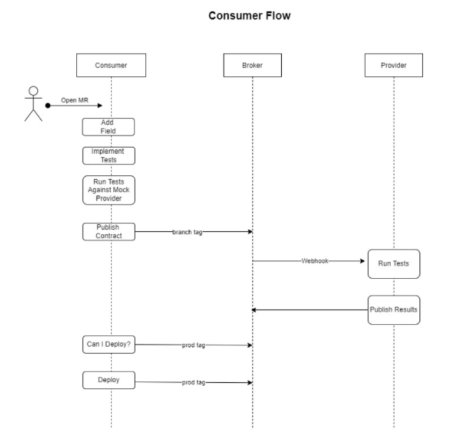
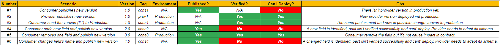
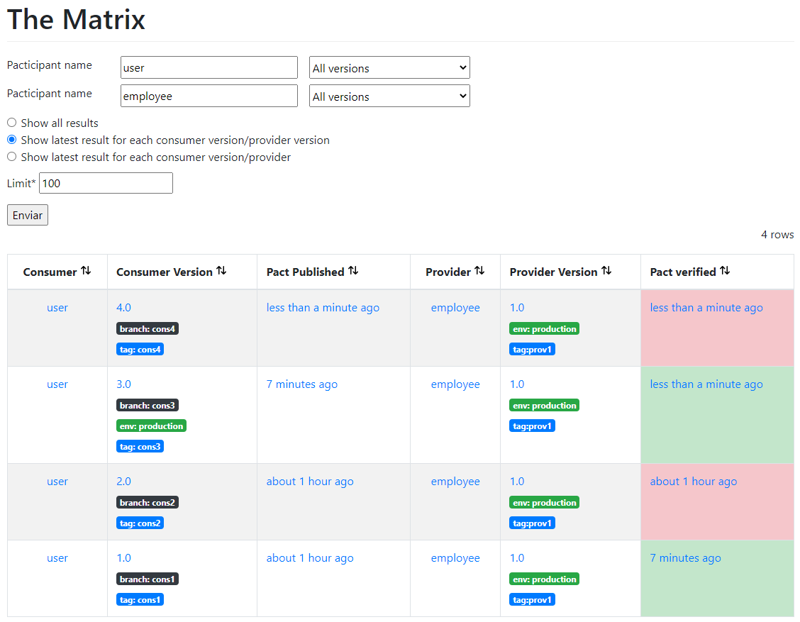

# User API for Tests

## Overview

This API was developed aims to be used in contract testing demonstration.

It's an API that controls the access of users in organizational context based on other source as an Employees.

From now the API (/user) just exposes verbs GET and POST to check the employees already registered in API employees. If user exists
as an employee, so this API will generate a system user and password for the requester.

In perspective of contract testing, this API is the consumer and will publish the contracts everytime that needs to deploy app.

It is necessary to run this application together with its provider (employee).

## Requirements

- [*JAVA*](https://www.oracle.com/br/java/technologies/javase-jdk11-downloads.html)
- [*Spring Boot*](https://spring.io/projects/spring-boot)
- [*Maven*](https://maven.apache.org/download.cgi)
- [*Pact*](https://docs.pact.io/)

These listed tools below, can be download in https://mvnrepository.com/ .

## Project Structure

- user-api
    - scr
        - main
            - java
                - com
                    - user
                        - config.: Configurations related to swagger and other needs.
                        - controllers.: Controller responsible to provide and expose possibilities to create and query users.
                        - entities.: Database definitions about entities used by controller.
                        - mock.: Class to control wiremock when the app is performed with mock option.
                        - model.: Attributes to represent the model of entities.
                        - repositories.: Interface to interact with data repositories.
                        - UserApiApplication (Main Class)
                    - util.: Support classes.
                      resources.: Definitions of H2 instances and if service will run with real or mocked data.

        - test
            - java
                - pt
                    - com
                        - model.: Test models to interact, set and get data during tests.
                        - test
                            - consumer.: Definition of contracts and tests by consumer
                        - util.: Support classes to test.
                      
        - target
          - pacts.: All pacts generated and published by consumer that will be sent to broker.

## How to Run

1. Start docker-compose using the command "docker-compose up" to deploy Pact Broker.

2. To simulate a pipeline were created 2 scripts (windows batch files).:

   2.1. 1_run_app.: Inittialy this script just will run the app (in application.properties, you can define if it will use a real or mock data).
   To run it just execute the 1_run_app.bat in the terminal. (cmd/powershell). Is not mandatory run this step if you just
   want run the contract tests.

   2.1. 2_run_build_consumer.: This script will simulate all steps needed to contemplate a contract testing.:
    1. Consumer Publishing Pacts
    2. Webhook to Provider Verification (Publishing Results to Broker)
    3. Can I Deploy to Prod?
    4. Record Deploy to Prod (Considering the simulation of a real deploy)
       To run it just execute the 2_run_build_consumer.bat in the terminal with parameters version and 
       tag (e.g .\2_run_build_consumer.bat 1.0 CONS1). 
       If you need, is possible perform the commands in a isolated way, just copy/paste and also run in the terminal.
    5. To run these tests and verify the contract against the provider, you need to run the provider app (employee-api) and appoint
       the path in this variable (set path_provider=<<path to provider>>).

All published contracts (target\pacts) and results will be stored in Pact Broker (http://localhost:9292/).

## Contract Testing Flow

The flow used in this solution was designed considering local execution but simulating a pipeline flow.

## Test Scenarios

## Pact Matrix

## References

- [*Pact*](https://docs.pact.io/)
- [*Kreuzwerker Post*](https://kreuzwerker.de/post/introduction-to-consumer-driven-contract-testing)
- [*Baeldung Post*](https://www.baeldung.com/pact-junit-consumer-driven-contracts)

## Contacts and Maintainers

If you have questions or suggestions, please contact the current maintainers.:

-   André Diegues Rodrigues - andrevdrodrigues@gmail.com

